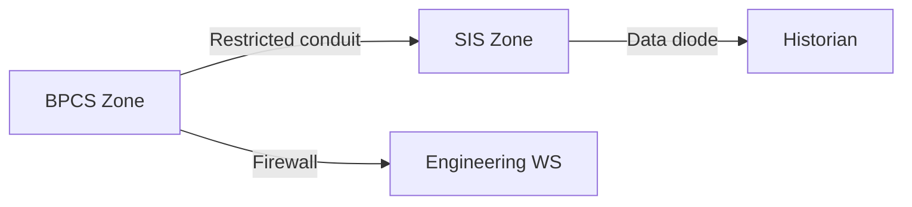

## Two disciplines, one plant

Walk into any petrochemical facility and you will find two teams that both use the word "risk" but mean very different things. The **process-safety** engineer is worried about overpressure, thermal runaway, and toxic release. The **cybersecurity** analyst is worried about unauthorised access, lateral movement, and data exfiltration.

IEC 62443 was written to bridge these two worlds. It borrows risk-assessment vocabulary from **IEC 61511** (functional safety) and applies it to the cyber domain. Understanding where the vocabularies overlap — and where they diverge — is essential before you touch any risk register.

## Shared concepts

<ResponsiveTable>

| Concept | Safety meaning | Cyber meaning |
|---|---|---|
| **Hazard** | Physical condition that can cause harm | Vulnerability + threat pair that can cause harm |
| **Risk** | Likelihood × Severity of harm to people/environment | Likelihood × Impact on control-system function |
| **Layer of protection** | Independent safety function (relief valve, SIS trip) | Independent security control (firewall, MFA, segmentation) |
| **Defence in depth** | Multiple barriers preventing a single failure from reaching people | Multiple controls preventing a single exploit from reaching the process |
| **SIL / SL** | Safety Integrity Level (IEC 61508/61511) | Security Level (IEC 62443) |

</ResponsiveTable>

<HighlightBox>
  
Key insight

  
SIL and SL are structurally analogous but independently assessed. A Safety Instrumented System (SIS) rated SIL 3 may still be at SL 1 if it sits on an unprotected network.

</HighlightBox>

## Where the vocabularies diverge

### 1. Threat actors are intentional

Process safety assumes **random failure** — a gasket degrades, a sensor drifts, a valve sticks. The failure rate is stochastic and can be modelled with bathtub curves and mean-time-between-failure data.

Cybersecurity assumes **intentional adversaries** — humans who adapt, learn, and try again. You cannot model a nation-state APT with a Weibull distribution.

### 2. Common-cause failure has a new source

In safety engineering, common-cause failure means a single root cause defeats multiple barriers (e.g. a flood takes out both the primary and backup pump). In cybersecurity, **a single vulnerability in shared firmware can defeat every device of the same model simultaneously**. TRITON demonstrated this: the attacker targeted the Triconex safety controller because one firmware exploit gave access to every unit at the site.

### 3. Confidentiality matters in cyber but not in safety

Process safety has no concept of data secrecy. A relief valve does not care who knows its set-pressure. But a cyber attacker who can read PLC configuration over the network can plan a precision strike.

## The SIS problem

The Safety Instrumented System is the last line of defence between a process upset and a catastrophe. IEC 61511 requires the SIS to be **independent** of the Basic Process Control System (BPCS). But independence is often implemented as a separate controller on the **same network**.

<ExampleBox>
  In the 2017 TRITON attack, the adversary moved laterally from the corporate network to the DCS, then pivoted to the SIS network — which was reachable via a shared switch. The SIS was logically independent but <strong>not physically isolated</strong>.
</ExampleBox>

IEC 62443 addresses this gap through **zone separation**: the SIS belongs in its own zone with a dedicated conduit whose data-flow policy permits only the minimum traffic the safety function requires.

## Integrating the two disciplines

When you perform an IEC 62443-3-2 risk assessment (Module 1 of the Risk Assessment track), you must:

1. **Identify safety-critical zones** — any zone containing SIS controllers, safety PLCs, or burner-management systems.
2. **Assign the highest SL-T** to those zones — typically SL 3 or SL 4.
3. **Validate independence** — confirm that no single cyber exploit can defeat both the BPCS and the SIS.
4. **Cross-reference with the SIL assessment** — if the SIS is rated SIL 3, the supporting cyber controls must be at least SL 2 to maintain the claimed safety integrity.

<AnalogyBox>
  Think of process safety as the hull of a ship and cybersecurity as the compartment doors. The hull keeps water out under normal conditions. The doors keep a breach in one section from sinking the whole vessel. If someone can open all the doors remotely, the hull alone is not enough.
</AnalogyBox>

<KeyTakeaways>
  - Process safety and cybersecurity share the concepts of risk, defence in depth, and layers of protection.
  - They diverge on threat modelling: random failure vs intentional adversary.
  - The SIS must be in its own security zone with the highest SL-T.
  - SIL and SL are independent assessments that must be cross-referenced.
  - A cyber exploit that defeats the SIS can negate decades of safety engineering.
</KeyTakeaways>

## Quick check

> Your safety engineer says, "The SIS is SIL 3 — it's already hardened." In three sentences, explain why a SIL rating does not guarantee cyber resilience.
