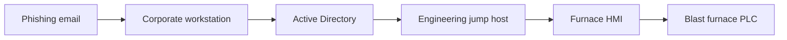

## Why case studies matter

Theory tells you what could happen. Case studies tell you what **did** happen — and what the consequences looked like when they arrived not in a risk matrix but in a control room, an emergency ward, or a regulatory hearing.

This lesson examines four incidents where cybersecurity failures in industrial environments produced real-world harm. Each case maps back to specific IEC 62443 controls that, had they been in place, would have reduced or prevented the outcome.

<HighlightBox>
  
Study approach

  
For each case: understand the <strong>attack path</strong>, the <strong>physical consequence</strong>, and the <strong>IEC 62443 control gap</strong>. The quiz will test all three.

</HighlightBox>

## Case 1: Maroochy Shire sewage spill (2000)

### What happened

A disgruntled former contractor used a stolen laptop and a radio transmitter to issue unauthorised commands to 150 sewage-pump stations in Queensland, Australia. Over three months he caused **800,000 litres of raw sewage** to flood parks, creeks, and the grounds of a Hyatt Regency hotel.

### Attack path

1. Attacker obtained insider knowledge of the SCADA system during his employment.
2. Used a commercially available radio modem to impersonate the central SCADA master.
3. Sent pump-disable commands to remote telemetry units (RTUs).
4. Alarms were generated but misattributed to equipment faults.

### IEC 62443 control gaps

<ResponsiveTable>

| Gap | IEC 62443 control |
|---|---|
| No authentication on radio commands | FR 1 – Identification & Authentication (SR 1.1) |
| No revocation of former employee's access | FR 2 – Use Control (SR 2.1) |
| Alarms not correlated for cyber cause | FR 6 – Timely Response to Events (SR 6.1) |

</ResponsiveTable>

## Case 2: Davis-Besse nuclear plant worm (2003)

### What happened

The Slammer worm entered the Davis-Besse nuclear power plant's corporate network, traversed an unsegmented bridge to the plant network, and disabled the **Safety Parameter Display System (SPDS)** for nearly five hours. Operators lost their primary dashboard for reactor safety status.

### Attack path

1. Worm entered through a contractor's VPN connection that bypassed the corporate firewall.
2. Propagated via SQL Server vulnerability (MS02-039) to every reachable Windows host.
3. Overwhelmed the SPDS server with traffic; the server crashed.
4. No network segmentation between corporate and plant networks.

### Physical consequence

The plant was in a scheduled outage, so no immediate safety risk. The NRC determined that if the plant had been operating, operators would have lost safety-critical instrumentation during any concurrent process upset.

### IEC 62443 control gaps

- **No IDMZ** between corporate and plant — violates the zone-and-conduit model (IEC 62443-3-2).
- **No VPN access control** for contractor laptops — FR 1 (SR 1.2, remote access).
- **No patching programme** for the SPDS server — FR 3 (SR 3.3, security patch management).

## Case 3: German steel mill (2014)

### What happened

The German Federal Office for Information Security (BSI) reported that attackers compromised a steel mill's corporate network via spear-phishing, then pivoted to the plant network. They gained control of furnace-management systems and **prevented a controlled shutdown of a blast furnace**, causing massive physical damage.

### Attack path

### Physical consequence

An uncontrolled blast-furnace shutdown is one of the most expensive failures in heavy industry. Molten metal solidifies inside the vessel; the furnace must be rebuilt. The BSI described the damage as **"massive."**

### IEC 62443 control gaps

- Flat network between corporate and OT — no zone separation.
- No MFA on engineering jump hosts — FR 1 (SR 1.7).
- No application whitelisting on HMI — FR 3 (SR 3.2).
- No network monitoring for lateral movement — FR 6 (SR 6.2).

## Case 4: Oldsmar water treatment (2021)

### What happened

An unknown actor remotely accessed the SCADA system at the Oldsmar, Florida water treatment plant and attempted to increase the sodium hydroxide (lye) dosage from **100 ppm to 11,100 ppm** — a 111× increase that, if undetected, could have caused serious chemical burns to anyone drinking the water.

### Attack path

1. Attacker used **TeamViewer** installed on the HMI workstation for remote support.
2. Shared password across multiple operators; no MFA.
3. Attacker moved the mouse, changed the NaOH setpoint, and exited.
4. An operator watching the screen noticed the mouse moving and reverted the change within minutes.

<ExampleBox>
  The Oldsmar incident is often cited as "the attack that was caught by luck." A single operator happened to be watching the HMI at the exact moment the attacker changed the setpoint. No automated alert fired.
</ExampleBox>

### IEC 62443 control gaps

- Remote-access tool with shared credentials — FR 1 (SR 1.1, SR 1.5).
- No process-safety interlock on NaOH dosage — outside IEC 62443 scope but highlights the SIS gap.
- No alarm on extreme setpoint change — FR 6 (SR 6.1).
- No network segmentation — the HMI was directly reachable from the internet via TeamViewer.

## Patterns across the cases

<ResponsiveTable>

| Pattern | Cases where it appears |
|---|---|
| No network segmentation (flat network) | All four |
| No authentication or weak authentication | Maroochy, Davis-Besse, Oldsmar |
| Remote access as the entry point | Davis-Besse, German steel mill, Oldsmar |
| Alarms missed or misattributed | Maroochy, Davis-Besse, Oldsmar |
| Insider knowledge exploited | Maroochy |
| Phishing as initial access | German steel mill |

</ResponsiveTable>

<HighlightBox>
  
The recurring lesson

  
Network segmentation (zones and conduits) would have reduced the blast radius in every single case. It is the single highest-leverage control in ICS cybersecurity.

</HighlightBox>

<KeyTakeaways>
  - Real ICS incidents have caused environmental damage, loss of safety instrumentation, physical destruction, and near-poisoning of a public water supply.
  - The most common root cause is a flat network with no zone separation.
  - Remote access without MFA is the most exploited entry point.
  - Alarms that are not correlated for cyber causes are routinely missed.
  - Every case maps to specific IEC 62443 Foundational Requirements that were not implemented.
</KeyTakeaways>

## Quick check

> Pick any one of the four cases. Describe the single IEC 62443 control that, if implemented, would have had the greatest impact on preventing or containing the incident. Justify your choice in three sentences.
