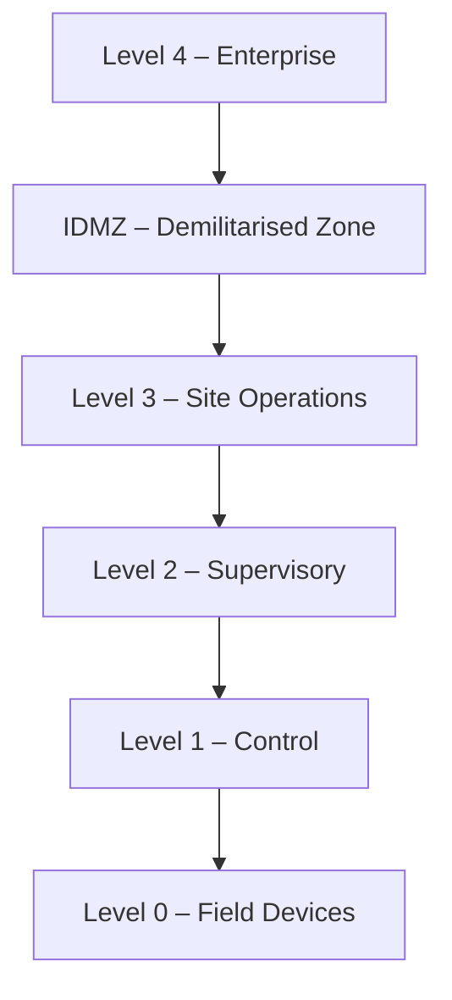

## Why a reference model matters

Before you can secure a control system, you need a shared vocabulary for **where things are**. The Purdue Enterprise Reference Architecture (PERA) — originally developed by Theodore J. Williams at Purdue University in the 1990s — gives you that vocabulary.

IEC 62443-1-1 adopts Purdue as the canonical reference model for describing industrial network architecture. Every zone diagram, every conduit definition, every SL-T assignment in the rest of this program is anchored to Purdue levels.

## The five levels

<ResponsiveTable>

| Level | Name | What lives here | Typical protocols |
|---|---|---|---|
| **4** | Enterprise | ERP, email, corporate apps | HTTPS, SMTP, SQL |
| **3** | Site Operations | Historian, patch server, AV server | OPC-UA, SQL, SMB |
| **IDMZ** | Demilitarised Zone | Data diode, reverse proxy, jump host | Varies — broker/relay only |
| **2** | Supervisory | HMI, SCADA server, engineering workstation | OPC-DA, Modbus/TCP, proprietary |
| **1** | Control | PLC, RTU, DCS controller | EtherNet/IP, Profinet, S7comm |
| **0** | Field | Sensors, actuators, drives, relays | 4-20 mA, HART, IO-Link |

</ResponsiveTable>

## The IDMZ: the most misunderstood layer

The Industrial Demilitarised Zone sits **between Level 3 and Level 4**. Its job is simple: **nothing passes through it directly.** Every data flow must be brokered — copied, relayed, or proxied — so that no direct IP session spans the boundary.

<HighlightBox>
  
IDMZ rule of thumb

  
If you can <code>ping</code> from the corporate LAN to any device on Level 2 or below, you do not have an IDMZ. You have a firewall rule that someone will eventually misconfigure.

</HighlightBox>

### What belongs in the IDMZ

- **Historian mirror / relay** — Level 3 historian pushes data up; a relay in the IDMZ copies it to a corporate-accessible read replica.
- **Patch staging server** — patches are pulled from the internet into the IDMZ, scanned, then pushed down to Level 3.
- **Remote-access jump host** — engineers RDP into a hardened bastion in the IDMZ, then connect down. No direct tunnel.
- **Data diode** (hardware-enforced unidirectional gateway) — for the highest-security segments.

### What does NOT belong in the IDMZ

- Active Directory domain controllers (move them to Level 3 or 4).
- Shared file servers accessible from both sides.
- Any device that initiates sessions in both directions simultaneously.

## Why Purdue still matters

Critics argue that cloud-connected IIoT devices, edge computing, and remote monitoring have made Purdue obsolete. They are wrong — but they have a point.

Purdue was designed for a world where OT networks were physically isolated. Today, many Level 2 and Level 3 devices have outbound connectivity to cloud dashboards, vendor telemetry, and remote-support tools.

<AnalogyBox>
  Purdue is not a floor plan — it is a fire code. The code still applies even if you have renovated the building. You may add new rooms, but you still need fire doors between them.
</AnalogyBox>

IEC 62443 extends Purdue by adding **zones and conduits** (covered in the Risk Assessment track). A zone can span multiple Purdue levels if the devices share the same security requirements, and a conduit is any communication path between zones — wired or wireless, local or cloud.

<KeyTakeaways>
  - The Purdue model defines five levels (0–4) plus an IDMZ.
  - Level 0/1 is the physical process; Level 2 is supervisory; Level 3 is site operations; Level 4 is enterprise.
  - The IDMZ brokers all traffic between IT and OT — no direct sessions allowed.
  - Purdue is still the canonical reference in IEC 62443 even in cloud-connected environments.
  - Zones and conduits extend Purdue to handle modern architectures.
</KeyTakeaways>
