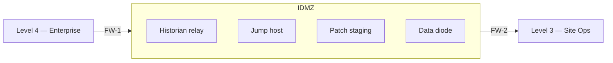

## The boundary that matters most

If you had to pick one line on a network diagram where a firewall misconfiguration could cascade into a plant-safety event, it would be the boundary between **Level 3 (site operations)** and **Level 4 (enterprise)**. The IDMZ sits on that line. Get it right and a corporate breach stays corporate. Get it wrong and the attacker has a direct path to the process.

## Level 3: site operations

Level 3 is the **operational back office** of the plant. It contains the servers and services that support the control system but are not part of the real-time control loop.

<ResponsiveTable>

| System | Role | Why it matters |
|---|---|---|
| **Process historian server** | Long-term time-series storage | Primary data source for trend analysis and incident investigation |
| **Patch management server** | WSUS or SCCM relay for OT patches | Controls what software reaches Level 2 workstations |
| **Antivirus / EDR server** | Signature and policy distribution | Detects known malware on Level 2/3 endpoints |
| **OPC aggregation server** | Protocol translation / data broker | Bridges between vendor-specific protocols and standard interfaces |
| **Engineering workstation** | PLC programming, configuration | Highest-privilege device on the OT network — often the attacker's ultimate target |
| **Domain controller (OT)** | Active Directory for OT accounts | Separate from corporate AD; forest trust must be one-way or absent |

</ResponsiveTable>

<HighlightBox>
  
The engineering workstation

  
This is the single most dangerous device on the OT network. It has the credentials and software to reprogram every PLC on the floor. Treat it as a Tier 0 asset — locked cabinet, MFA, full audit logging.

</HighlightBox>

## The IDMZ in detail

The Industrial Demilitarised Zone is a **network segment** that sits between Level 3 and Level 4. Its design principle is simple:

> **No direct traffic may traverse the IDMZ.** Every data flow must be brokered, relayed, or copied by a service running inside the IDMZ itself.

### IDMZ architecture patterns

### Pattern 1: Dual-firewall IDMZ

Two firewalls — one facing Level 4, one facing Level 3 — with the IDMZ segment between them. Each firewall has independent rule sets and is managed by a different team (IT manages FW-1, OT manages FW-2).

### Pattern 2: Data diode

A hardware-enforced **unidirectional gateway** that physically prevents any traffic from flowing from Level 4 into Level 3. Data can only flow **out** (historian data to the corporate BI dashboard) but never **in**.

<AnalogyBox>
  A data diode is a one-way valve for data. Like a check valve on a water pipe, it allows flow in one direction and physically blocks the reverse. No software vulnerability can override the hardware constraint.
</AnalogyBox>

### Pattern 3: Cloud demilitarised zone (C-DMZ)

For plants with IIoT or cloud connectivity, a C-DMZ extends the IDMZ concept. An edge gateway in the IDMZ initiates outbound connections to the cloud; no inbound connections are permitted from the internet to any OT device.

## Common IDMZ mistakes

<ExampleBox>
  The most common IDMZ failure is not a design flaw — it is a <strong>maintenance shortcut</strong>. Six months after commissioning, someone opens a "temporary" firewall rule to let the corporate ERP pull data directly from the Level 3 historian. The rule is never removed. The IDMZ is now a fiction.
</ExampleBox>

Other mistakes:

- **Shared credentials** between IDMZ jump hosts and Level 3 systems.
- **VPN tunnels** that terminate inside Level 3 instead of inside the IDMZ.
- **Flat VLAN** that spans both the IDMZ and Level 3 — making the firewalls irrelevant.
- **No monitoring** inside the IDMZ itself — it becomes a blind spot.

## Validating your IDMZ

A quick validation checklist:

1. **Can you traceroute from any Level 4 host to any Level 2 device?** If yes, the IDMZ is broken.
2. **Are there any firewall rules that permit direct TCP sessions across both firewalls?** If yes, fix them.
3. **Is every service in the IDMZ hardened, patched, and monitored?** If not, the IDMZ is the weakest link.
4. **Is the OT firewall managed by a different team than the IT firewall?** If not, a single compromised admin account opens both gates.

<KeyTakeaways>
  - Level 3 contains the operational back office: historians, patch servers, engineering workstations, OT domain controllers.
  - The engineering workstation is the highest-privilege device on the OT network.
  - The IDMZ brokers all traffic between IT and OT — no direct sessions allowed.
  - Dual-firewall and data-diode patterns are the two standard IDMZ architectures.
  - The most common IDMZ failure is a "temporary" firewall rule that is never removed.
</KeyTakeaways>
