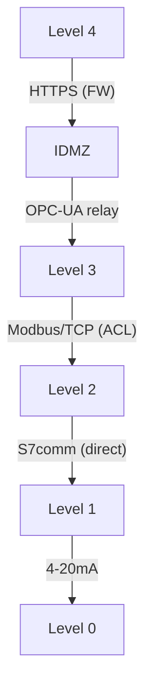

## The real-world challenge

Textbook Purdue diagrams show clean, colour-coded layers. Actual plant networks look like a bowl of spaghetti — VLANs that span multiple levels, wireless access points bolted to cable trays, vendor laptops plugged into any available port, and a historian that talks to both the corporate BI dashboard and the Level 1 PLC ring.

This lesson teaches you how to take a messy brownfield network and **map it systematically onto the Purdue model** so you can begin a structured IEC 62443 risk assessment.

## Step 1: Build the asset inventory

Before you can assign levels, you need to know what is on the network.

<ResponsiveTable>

| Method | What it finds | Risk |
|---|---|---|
| **Switch MAC tables / ARP cache** | Every device with an Ethernet address | Passive — safe for OT |
| **DHCP lease tables** | Devices with dynamic IPs | Passive — safe |
| **Configuration review** | Firewalls, switches, routers — what rules exist | Passive — safe |
| **Passive network capture** | Every IP conversation, every protocol | Passive — safe (use a SPAN port) |
| **Active scanning (Nmap, etc.)** | Open ports, service banners, OS fingerprints | **Dangerous** — can crash PLCs. Use with extreme caution and plant-operator approval only. |

</ResponsiveTable>

<HighlightBox>
  
Rule: passive first, always

  
Never run an active scan on an OT network without explicit written approval from the plant operator. A SYN scan on a legacy PLC can cause a watchdog fault and trip the process.

</HighlightBox>

### Asset inventory template

For each device, record:

- **Hostname / IP** — what the network sees.
- **Device type** — PLC, HMI, historian, switch, firewall, etc.
- **Vendor / model / firmware** — for vulnerability correlation.
- **Function** — what process role does it serve?
- **Connectivity** — what other devices does it talk to, and on which ports/protocols?

## Step 2: Assign Purdue levels

With the inventory in hand, assign each device to a Purdue level using these rules:

<ResponsiveTable>

| If the device... | Assign to |
|---|---|
| Directly measures or acts on the physical process | Level 0 |
| Executes control logic (PLC, RTU, DCS controller) | Level 1 |
| Provides operator interface or supervisory data (HMI, SCADA, historian) | Level 2 |
| Supports operations but is not real-time (patch server, engineering WS, OT AD) | Level 3 |
| Is a business system (ERP, email, corporate apps) | Level 4 |

</ResponsiveTable>

### Devices that don't fit

Some devices straddle levels. The most common:

- **Engineering workstation** — used to programme Level 1 PLCs but sits physically at Level 3. Assign to Level 3; note the conduit to Level 1.
- **Historian** — collects data from Level 1/2 and serves dashboards to Level 3/4. Assign to Level 3; note conduits in both directions.
- **Wireless access point** — could serve Level 2 tablets or Level 4 laptops. Assign by the **most sensitive** devices it reaches.

## Step 3: Draw the conduits

A conduit is any communication path between two Purdue levels (or between two zones at the same level). For each conduit, document:

1. **Source and destination** — which level/zone to which level/zone.
2. **Protocols** — what traffic is permitted (Modbus/TCP, OPC-UA, RDP, etc.).
3. **Direction** — unidirectional or bidirectional.
4. **Enforcement** — what device controls the conduit (firewall, ACL, data diode, nothing).

<ExampleBox>
  A common brownfield finding: the Level 2 HMI has a direct Ethernet connection to both the Level 1 PLC ring <strong>and</strong> the Level 3 historian LAN. This makes the HMI a <strong>bridge device</strong> — one exploit gives the attacker a path from Level 3 to Level 1 without crossing a firewall.
</ExampleBox>

## Step 4: Identify violations

With the map drawn, look for anything that breaks the Purdue hierarchy:

- **Level-skipping conduits** — a Level 4 device talking directly to a Level 1 PLC (skipping Level 3 and the IDMZ).
- **Bridge devices** — a single host with interfaces on two non-adjacent levels.
- **Uncontrolled conduits** — any path with no firewall, ACL, or data diode.
- **Flat VLANs** — a single broadcast domain spanning multiple levels.

Each violation is a finding that feeds into your IEC 62443-3-2 risk assessment (Risk Assessment track, Module 0).

## Worked example: small water-pump station

<DeepDive title="Walkthrough: mapping a 12-device network">

**Asset inventory:**

| # | Device | Type | IP |
|---|---|---|---|
| 1 | Corporate laptop | Endpoint | 10.0.1.10 |
| 2 | Email server | Server | 10.0.1.20 |
| 3 | Plant historian | Server | 10.0.2.10 |
| 4 | Engineering laptop | Workstation | 10.0.2.20 |
| 5 | WinCC HMI | HMI | 10.0.3.10 |
| 6 | S7-1200 PLC #1 | Controller | 10.0.3.100 |
| 7 | S7-1200 PLC #2 | Controller | 10.0.3.101 |
| 8 | Pressure sensor | Instrument | (via PLC I/O) |
| 9 | Flow meter | Instrument | (via PLC I/O) |
| 10 | Pump VFD | Actuator | (via PLC I/O) |
| 11 | Managed switch | Network | 10.0.3.1 |
| 12 | Router/firewall | Network | 10.0.1.1 |

**Findings:**
- All OT devices (HMI, PLCs, historian, engineering laptop) are on the **same VLAN** (10.0.3.0/24) — flat network.
- The historian has a second NIC on the corporate LAN (10.0.1.0/24) — bridge device.
- No IDMZ exists.
- The engineering laptop can reach the PLCs directly — no access control.

**Purdue assignment:**
- Level 0: sensors, VFD
- Level 1: PLCs
- Level 2: HMI
- Level 3: historian, engineering laptop
- Level 4: corporate laptop, email server
- IDMZ: does not exist (finding)

</DeepDive>

<KeyTakeaways>
  - Start with a passive asset inventory — never active-scan OT without written approval.
  - Assign each device to a Purdue level based on its function, not its physical location.
  - Document every conduit: source, destination, protocol, direction, enforcement mechanism.
  - Look for violations: level-skipping, bridge devices, uncontrolled conduits, flat VLANs.
  - Every violation becomes a finding in your IEC 62443-3-2 risk assessment.
</KeyTakeaways>

## Quick check

> You discover that the plant historian has two network interfaces: one on the PLC VLAN and one on the corporate LAN. Which Purdue principle does this violate, and what is the recommended fix?
