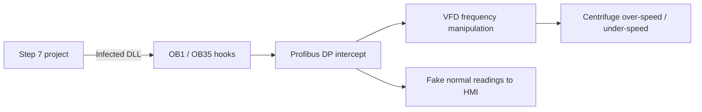

## The weapon that changed everything

In June 2010, the Belarusian security firm VirusBlokAda identified a Windows worm that exploited four zero-day vulnerabilities simultaneously. It was not trying to steal credit-card numbers or encrypt files for ransom. It was designed to do one thing: **destroy centrifuges at the Natanz uranium-enrichment facility in Iran**.

Stuxnet was the first publicly documented cyber weapon purpose-built for an industrial control system. It announced to the world that ICS is a legitimate — and vulnerable — military target.

## Attack timeline

<ResponsiveTable>

| Phase | Activity | Duration |
|---|---|---|
| **Reconnaissance** | Intelligence agencies map Natanz supply chain, identify Siemens S7-315/S7-417 PLCs and Step 7 software | Months–years |
| **Weaponisation** | Develop payload targeting Profibus DP communication between PLC and VFD; bundle with four Windows zero-days | Months |
| **Delivery** | Infected USB drives introduced via contractors and supply-chain partners | 2009–2010 |
| **Installation** | Worm propagates via network shares, printer spooler, and WinCC database; installs rootkit on Step 7 project files | Automatic |
| **Exploitation** | Payload modifies VFD frequency commands to centrifuge motors; alternates between 1,410 Hz and 2 Hz | Weeks |
| **Concealment** | Man-in-the-middle on Profibus: PLC reports normal speed to HMI while running destructive profile | Continuous |
| **Impact** | ~1,000 centrifuges destroyed; enrichment programme delayed by 1–2 years | 2009–2010 |

</ResponsiveTable>

## Technical deep dive

### The Windows propagation chain

Stuxnet used **four zero-day exploits** — an unprecedented investment:

1. **LNK file vulnerability (CVE-2010-2568)** — malicious .lnk file on USB auto-executes when the folder is viewed.
2. **Print spooler vulnerability (CVE-2010-2729)** — spreads to network printers and from there to other hosts.
3. **Windows Server Service (CVE-2008-4250)** — the same vulnerability used by Conficker, for network propagation.
4. **Task Scheduler privilege escalation (CVE-2010-3338)** — elevates to SYSTEM on the target.

### The PLC payload

The real weapon was the code injected into the Siemens S7-315 and S7-417 PLCs:

<HighlightBox>
  
The man-in-the-middle on the process

  
Stuxnet did not just attack the centrifuges. It <strong>lied to the operators</strong>. The HMI showed normal frequency readings while the physical motors were cycling between destructive extremes. This is the most dangerous capability an ICS attacker can have: the ability to create a false reality on the operator's screen.

</HighlightBox>

### Why it went undetected

- The payload only activated when it detected the specific Siemens configuration used at Natanz (PLC model, Profibus network topology, VFD vendor).
- On every other system, the worm propagated silently but did nothing destructive.
- The Step 7 rootkit hid modified code blocks from the engineering workstation — even a direct PLC upload/compare showed no changes.

## IEC 62443 lessons from Stuxnet

<ResponsiveTable>

| Stuxnet technique | IEC 62443 control that would have mitigated it |
|---|---|
| USB delivery via contractors | FR 2 – Use Control: removable media policy (SR 2.3) |
| Network propagation via zero-days | FR 5 – Restricted Data Flow: zone segmentation |
| Step 7 project infection | FR 3 – System Integrity: application whitelisting (SR 3.2) |
| PLC code modification | FR 3 – System Integrity: PLC change detection (SR 3.4) |
| Man-in-the-middle on Profibus | FR 3 – System Integrity: communication integrity (SR 3.1) |
| No detection for months | FR 6 – Timely Response: continuous monitoring (SR 6.1) |

</ResponsiveTable>

## Legacy

Stuxnet's lasting impact is not the centrifuges it destroyed. It is the **proof of concept** it provided to every nation-state, criminal group, and activist:

- ICS can be reached through the supply chain.
- PLC logic can be modified without the operator's knowledge.
- The physical process can be weaponised.

<ExampleBox>
  After Stuxnet, the number of ICS-targeted CVEs reported to ICS-CERT increased by <strong>600%</strong> between 2010 and 2015. The genie was out of the bottle.
</ExampleBox>

<KeyTakeaways>
  - Stuxnet was the first cyber weapon designed to destroy physical infrastructure via ICS.
  - It used four zero-days for propagation and a precision PLC payload for destruction.
  - Its most dangerous feature was the man-in-the-middle on the process — operators saw normal readings while centrifuges were being destroyed.
  - Zone segmentation, removable-media controls, PLC change detection, and continuous monitoring would have reduced the impact.
  - Stuxnet proved that ICS is a viable military target and triggered a global surge in ICS vulnerability research.
</KeyTakeaways>

## Quick check

> Stuxnet's PLC payload was a man-in-the-middle on the Profibus bus. Which IEC 62443 Foundational Requirement addresses communication integrity, and why is it particularly hard to implement on legacy fieldbus protocols?
