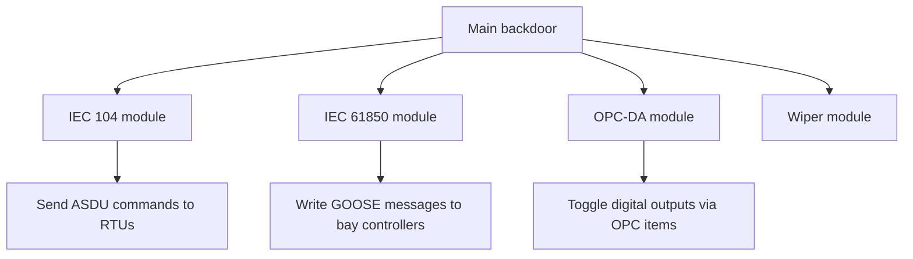

## The first grid-scale cyber attack

On 17 December 2016, a quarter of Kyiv lost power for about an hour. The cause was not a storm or a transformer failure. It was **Industroyer** (also called CrashOverride) — malware that spoke native ICS protocols and used them to open circuit breakers across a Ukrainian transmission substation.

Where Stuxnet targeted a single facility with a precision payload, Industroyer was built as a **modular, reusable framework** for attacking electrical grids. It was the first malware to natively implement IEC 104, IEC 61850, and OPC-DA — the protocols that run every modern power grid.

## Attack timeline

<ResponsiveTable>

| Phase | Activity |
|---|---|
| **Initial access** | Spear-phishing email with a malicious Word document targeting Ukrenergo staff |
| **Lateral movement** | Attacker moves through the corporate network, harvests credentials, reaches the OT segment |
| **Staging** | Installs Industroyer main backdoor and four protocol-specific payload modules |
| **Execution** | At 23:00 local time, payloads send "open breaker" commands via IEC 104, IEC 61850, and OPC-DA simultaneously |
| **Cover** | Wiper component destroys system files on HMI workstations to prevent operator recovery |
| **Impact** | ~230 MW of load disconnected; power restored manually after ~75 minutes |

</ResponsiveTable>

## The protocol payloads

Industroyer's architecture was modular. Each protocol module was a separate DLL loaded by a central launcher:

### IEC 104 module

**IEC 60870-5-104** is the standard protocol for telecontrol in European power grids. The Industroyer module:

1. Connected to RTU IP addresses hard-coded in a configuration file.
2. Sent **Select-Before-Operate (SBO)** commands to open circuit breakers.
3. Sent the commands in rapid succession across multiple RTUs simultaneously.

<HighlightBox>
  
Why this matters

  
IEC 104 has <strong>no authentication</strong>. Any device that can reach the RTU on TCP port 2404 can send valid commands. The protocol was designed for trusted, isolated serial links — not shared Ethernet with internet-reachable corporate networks behind a single firewall.

</HighlightBox>

### IEC 61850 module

**IEC 61850** is the modern substation-automation standard. The module crafted **GOOSE (Generic Object Oriented Substation Event)** messages — Ethernet Layer 2 multicasts used for fast trip signalling between protection relays. By injecting spoofed GOOSE frames, the attacker could force protection relays to trip.

### OPC-DA module

The module enumerated OPC-DA servers on the network, discovered available items (digital I/O points), and toggled them to the "open" position.

## The wiper: destroying the recovery path

After opening the breakers, Industroyer deployed a **wiper component** that:

- Overwrote critical Windows system files on HMI and SCADA workstations.
- Killed the Windows service responsible for auto-restart.
- Ensured operators could not use the digital control system to re-close the breakers.

The operators had to drive to each substation and **manually close the breakers** using physical switches — a process that took over an hour.

<ExampleBox>
  This "destroy the recovery path" tactic is now standard in ICS attack playbooks. The attacker's goal is not just to cause the outage but to <strong>maximise the time to recovery</strong>.
</ExampleBox>

## Comparison with the 2015 Ukraine attack

The December 2015 attack on three Ukrainian distribution companies (attributed to Sandworm) was the first known cyber attack to cause a power outage. But it was **manually operated** — attackers used compromised VPN connections and BlackEnergy backdoors to open breakers by clicking through the HMI interface.

Industroyer was the evolutionary leap: **fully automated, protocol-native, multi-vector.** It did not need a human at the keyboard during execution.

<ResponsiveTable>

| Feature | 2015 Ukraine attack | 2016 Industroyer |
|---|---|---|
| Execution | Manual (attacker at HMI) | Automated (protocol modules) |
| Protocols used | HMI software clicks | IEC 104, IEC 61850, OPC-DA |
| Recovery disruption | Firmware overwrite on serial-to-Ethernet converters | System wiper on Windows hosts |
| Reusability | Low (site-specific manual steps) | High (modular, configurable) |
| Power restored in | ~6 hours | ~75 minutes |

</ResponsiveTable>

## IEC 62443 control gaps

- **No network segmentation** between corporate and OT — attacker moved laterally from email to substation control.
- **No protocol authentication** — IEC 104 and GOOSE accepted commands from any source.
- **No application whitelisting** — the wiper executed without restriction on HMI workstations.
- **No out-of-band recovery** — operators relied on the same network the attacker had compromised.

<KeyTakeaways>
  - Industroyer was the first malware to natively implement ICS protocols (IEC 104, IEC 61850, OPC-DA).
  - It was modular, automated, and designed for reuse against any IEC 104 grid.
  - The wiper component maximised recovery time by destroying the digital control path.
  - Protocol-level authentication is the missing control — IEC 104 and GOOSE have none by default.
  - The evolution from manual (2015) to automated (2016) signals that future grid attacks will be faster and harder to contain.
</KeyTakeaways>
