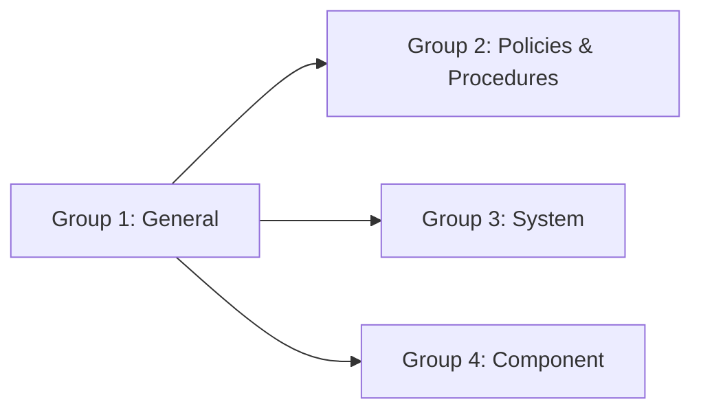
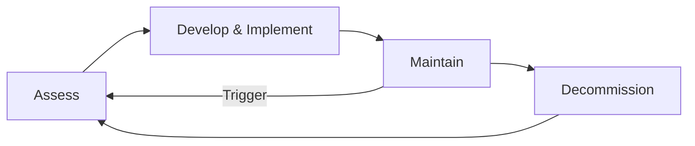

## The 62443 series at a glance

IEC 62443 is not a single standard. It is a **family of 14 documents** organised into four groups. Each group addresses a different stakeholder — asset owners, system integrators, component suppliers, or the standard itself.

This lesson covers the **Group 1 (General)** documents — the conceptual foundation on which everything else is built.

## IEC 62443-1-1: Concepts and models

**Status:** Published (Edition 1.0, 2009; Edition 2.0, 2024)

This is the **conceptual anchor** of the entire series. It defines:

### The security model

<ResponsiveTable>

| Concept | Definition | Where you'll use it |
|---|---|---|
| **Zone** | A grouping of assets that share the same security requirements | Risk assessment (3-2), system architecture |
| **Conduit** | A communication path between zones | Network design, firewall rules |
| **Security Level (SL)** | A measure of the security capability of a zone or system | Every risk assessment and design decision |
| **Foundational Requirements (FRs)** | Seven categories of security controls | System requirements (3-3), component requirements (4-2) |

</ResponsiveTable>

### The seven Foundational Requirements

<HighlightBox>
  
Memorise these — they appear everywhere

  
Every system requirement in 3-3, every component requirement in 4-2, and every SL vector element maps to one of these seven FRs.

</HighlightBox>

1. **FR 1 — Identification and Authentication Control (IAC)** — verify the identity of users, devices, and software.
2. **FR 2 — Use Control (UC)** — enforce authorised actions, least privilege, and role-based access.
3. **FR 3 — System Integrity (SI)** — ensure the system has not been tampered with.
4. **FR 4 — Data Confidentiality (DC)** — protect data from unauthorised disclosure.
5. **FR 5 — Restricted Data Flow (RDF)** — control communication between zones via conduits.
6. **FR 6 — Timely Response to Events (TRE)** — detect, log, and respond to security incidents.
7. **FR 7 — Resource Availability (RA)** — ensure the system remains operational under attack.

### The Security Level vector

An SL is not a single number. It is a **vector of seven values**, one per FR:

<FormulaBox title="Security Level vector">
  SL = (SL-IAC, SL-UC, SL-SI, SL-DC, SL-RDF, SL-TRE, SL-RA)
</FormulaBox>

Each element ranges from 0 to 4. The **overall SL of a zone** is the **minimum** across all seven elements — the chain is only as strong as its weakest link.

### SL types

- **SL-T (Target)** — the security level you need, based on risk assessment.
- **SL-C (Capability)** — the security level the system can achieve, based on its design.
- **SL-A (Achieved)** — the security level the system actually provides after deployment.

The gap between SL-T and SL-A is your **residual risk**.

## IEC 62443-1-2: Master glossary

**Status:** Published (Technical Specification)

This document is the **dictionary** of the series. It defines over 150 terms used across all 14 documents. Key terms you need from day one:

- **IACS** — Industrial Automation and Control System (the umbrella term for everything from PLCs to SCADA).
- **SUC** — System Under Consideration (the scope of your assessment).
- **Essential function** — any function whose loss directly impacts safety, the environment, or the product.

<AnalogyBox>
  Think of 1-2 as the Rosetta Stone. When the safety engineer says "hazard" and the cybersecurity analyst says "threat," 1-2 translates between them.
</AnalogyBox>

## IEC 62443-1-3: System security compliance metrics

**Status:** Published (Technical Specification, 2009)

This document defines how to **measure** whether a system meets its SL-T. It provides:

- Metrics for each FR at each SL.
- A scoring model: each System Requirement (SR) from 3-3 is tested as pass/fail.
- The aggregation rule: a zone achieves SL N for a given FR only if it passes all SRs required at that level.

<ExampleBox>
  If FR 1 at SL 2 requires SRs 1.1, 1.2, 1.3, 1.5, and 1.7, and your system passes all except SR 1.5, your achieved level for FR 1 is <strong>SL 1</strong> — even if every other SR is SL 3 compliant.
</ExampleBox>

## IEC 62443-1-4: IACS security lifecycle and use cases

**Status:** Published (Technical Report, 2024 — new in Edition 2.0)

This document describes the **security lifecycle** of an IACS from conception through decommissioning:

The lifecycle is **continuous, not linear**. A change in the threat landscape, a new vulnerability, or a plant expansion triggers a return to the Assess phase.

### Key lifecycle activities

- **Assess** — risk assessment per 3-2; define SL-T for each zone.
- **Develop & Implement** — design the system to meet SL-T (using 3-3 and 4-2); integrate and test.
- **Maintain** — patch management, monitoring, incident response, periodic reassessment.
- **Decommission** — secure data erasure, credential revocation, equipment disposal.

<KeyTakeaways>
  - IEC 62443 is a family of 14 documents in four groups: General, Policies, System, Component.
  - The Group 1 documents define concepts (1-1), terminology (1-2), metrics (1-3), and lifecycle (1-4).
  - There are seven Foundational Requirements; the SL is a vector of seven values, one per FR.
  - SL-T (target), SL-C (capability), and SL-A (achieved) measure the gap between need and reality.
  - The security lifecycle is continuous — reassess after any change in threat, vulnerability, or plant configuration.
</KeyTakeaways>
