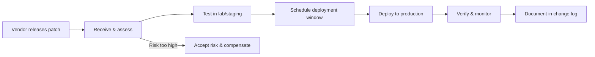

## Group 2: the organisational layer

Group 2 documents address the **people, policies, and processes** needed to establish and maintain an IACS security programme. Where Group 3 and 4 tell you what technical controls to implement, Group 2 tells you how to **organise the team, manage the suppliers, and sustain the programme over decades**.

## IEC 62443-2-1: Security programme requirements for IACS asset owners

**Status:** Published (2024 — major revision from 2010 edition)

This is the **management system standard** for asset owners. It defines what the organisation running the plant must do.

### Core requirements

<ResponsiveTable>

| Requirement area | What it means | Example |
|---|---|---|
| **Security policy** | A documented, board-endorsed policy for IACS security | "All OT zones must achieve SL-T by Q4 2026" |
| **Organisation and staffing** | Defined roles — CISO, OT security lead, plant security coordinator | Named individuals, not just org-chart boxes |
| **Risk assessment programme** | Ongoing, not one-time; triggered by changes | Per IEC 62443-3-2 methodology |
| **Security awareness training** | All personnel with OT access — operators, engineers, contractors | Annual + role-specific modules |
| **Incident response** | OT-specific IR plan — not a copy of the IT playbook | Includes SIS-safe shutdown procedures |
| **Change management** | Every change to the IACS goes through a security review | Patch deployment, firmware update, config change |
| **Audit and compliance** | Internal and external audits against the SL-T targets | Annual assessment cycle |

</ResponsiveTable>

<HighlightBox>
  
The 2024 revision

  
The 2024 edition aligns 2-1 with ISO 27001:2022 structure (Annex SL) so organisations with an existing ISMS can integrate IACS security without running two parallel management systems.

</HighlightBox>

### Security awareness vs technical training

2-1 distinguishes between:

- **Awareness** — everyone with physical or logical access to the IACS. Topics: phishing, USB hygiene, badge tailgating, reporting suspicious activity.
- **Training** — role-specific. Operators learn alarm triage. Engineers learn secure PLC programming. Incident responders learn OT forensics.

## IEC 62443-2-2: IACS protection ratings

**Status:** Under development (Committee Draft)

This document will define how to **rate** an organisation's security posture — not just the technical SL of individual zones, but the overall programme maturity. Think of it as a **maturity model** layered on top of the SL framework.

## IEC 62443-2-3: Patch management in the IACS environment

**Status:** Published (Technical Report, 2015)

Patching in OT is fundamentally different from patching in IT:

<ResponsiveTable>

| IT patching | OT patching |
|---|---|
| Automated, weekly, mandatory | Manual, quarterly (at best), risk-assessed |
| Reboot acceptable | Reboot may require a plant shutdown |
| Vendor patch = deploy immediately | Vendor patch = test in staging → validate with process engineer → schedule during planned outage |
| Rollback: restore from backup | Rollback: may require re-tuning control loops |

</ResponsiveTable>

### The 2-3 patch lifecycle

<ExampleBox>
  A Siemens S7-1500 firmware update may fix a known vulnerability but also changes the cycle-time behaviour of the PLC. The process engineer must re-validate that the control loop still meets its performance specification. This can take <strong>weeks of testing</strong> in a staging environment before the patch is approved for production.
</ExampleBox>

### Compensating controls

When a patch cannot be applied (legacy device, no vendor support, unacceptable process risk), 2-3 requires **compensating controls**:

- Network segmentation to reduce the attack surface.
- Host-based firewall or IPS rules targeting the specific vulnerability.
- Enhanced monitoring and alerting for exploitation attempts.
- Physical access restrictions to the unpatched device.

## IEC 62443-2-4: Security programme requirements for IACS service providers

**Status:** Published (2019)

This document applies to **system integrators, maintenance providers, and managed-security vendors** — anyone who touches the IACS on behalf of the asset owner.

### Key requirements

- **Secure remote access** — service providers must use the asset owner's approved remote-access solution, not their own tools (no TeamViewer, no AnyDesk).
- **Credential management** — unique accounts per individual; no shared service-provider credentials.
- **Data handling** — project files, PLC programs, and configuration data must be encrypted in transit and at rest.
- **Supply-chain transparency** — the service provider must disclose all third-party components used in the delivered system.
- **Hardening guidelines** — the integrator must deliver the system with a documented hardening guide (disabled services, closed ports, default passwords changed).

<AnalogyBox>
  If 2-1 is the rules for the homeowner, 2-4 is the rules for the contractor. The contractor must follow the homeowner's security policy, use the homeowner's approved tools, and hand over the keys at the end of the job.
</AnalogyBox>

<HighlightBox>
  
Procurement tip

  
Include IEC 62443-2-4 compliance as a contractual requirement in every IACS procurement and service agreement. If the integrator cannot meet 2-4, they should not be touching your plant network.

</HighlightBox>

<KeyTakeaways>
  - 2-1 defines the asset owner's security management system — policy, staffing, training, IR, change management.
  - 2-3 covers OT patch management — risk-assessed, tested, scheduled, with compensating controls when patches cannot be applied.
  - 2-4 sets requirements for service providers — secure remote access, unique credentials, supply-chain transparency.
  - The 2024 revision of 2-1 aligns with ISO 27001 for easier integration.
  - Include 2-4 compliance in every IACS procurement contract.
</KeyTakeaways>
