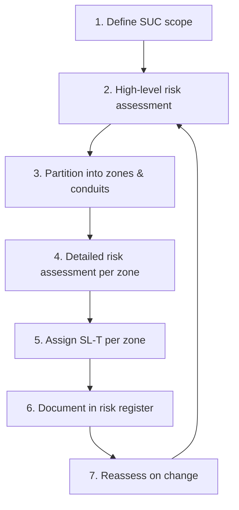
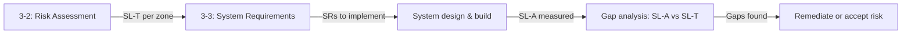

## Group 3: the system layer

Group 3 documents address the **technical architecture** of the IACS. Where Group 2 is about organisation and process, Group 3 is about **zones, conduits, risk scores, and the specific security requirements that systems must meet**.

This lesson introduces the two most operationally important documents in the entire series.

## IEC 62443-3-2: Security risk assessment for system design

**Status:** Published (2020)

This is the **risk-assessment methodology** that drives every security decision in an IEC 62443 programme. The Risk Assessment specialist track (the next course after Foundations) covers it in full depth; here we introduce the structure.

### The 3-2 process

### Step by step

<ResponsiveTable>

| Step | Input | Output |
|---|---|---|
| **1. Define SUC** | Plant drawings, asset inventory, network diagrams | Scope boundary — what is in and out of the assessment |
| **2. High-level risk assessment** | Threat landscape, business-impact analysis | Initial risk ranking; identification of worst-case scenarios |
| **3. Partition** | Network topology, data flows, process dependencies | Zone & conduit diagram |
| **4. Detailed risk assessment** | Threats per zone, vulnerabilities, consequences, likelihood | Risk scores per zone |
| **5. Assign SL-T** | Risk scores, tolerable risk threshold | SL-T vector for each zone |
| **6. Document** | All of the above | Formal risk register |
| **7. Reassess** | Change triggers (new threat, new asset, process modification) | Updated risk register |

</ResponsiveTable>

### The zone & conduit diagram

This is the single most important artefact of a 3-2 assessment. It shows:

- Every zone, labelled with its SL-T.
- Every conduit between zones, labelled with permitted protocols, direction, and enforcement mechanism.
- The Purdue level of each zone.

<ExampleBox>
  A well-drawn zone & conduit diagram lets a new engineer walk into the plant, look at one page, and understand: where the security boundaries are, what traffic is allowed, and what level of protection each zone requires.
</ExampleBox>

## IEC 62443-3-3: System security requirements and security levels

**Status:** Published (2013; Edition 2.0 expected)

This is the **technical requirements catalogue** — the document that tells you exactly what a system must do at each Security Level.

### Structure

3-3 organises its requirements as:

- **7 Foundational Requirements (FRs)** — the same seven from 1-1.
- **System Requirements (SRs)** — specific, testable requirements under each FR.
- **Requirement Enhancements (REs)** — additional requirements that apply at higher SLs.

### How SRs map to SLs

Each SR has a **base level** and optional **enhancements**:

<ResponsiveTable>

| SR | Description | SL 1 | SL 2 | SL 3 | SL 4 |
|---|---|---|---|---|---|
| SR 1.1 | Human user identification & authentication | Required | Required | Required | Required |
| SR 1.1 RE 1 | Unique identification | — | Required | Required | Required |
| SR 1.1 RE 2 | Multifactor authentication | — | — | Required | Required |
| SR 1.1 RE 3 | Hardware-backed credential storage | — | — | — | Required |

</ResponsiveTable>

<HighlightBox>
  
Reading the table

  
To meet SL 2 for FR 1, your system must implement SR 1.1 (base) <strong>plus</strong> SR 1.1 RE 1. To meet SL 3, add RE 2. To meet SL 4, add RE 3. Each SL is a strict superset of the one below.

</HighlightBox>

### Key SRs you'll encounter repeatedly

- **SR 1.1** — Human user identification & authentication.
- **SR 2.1** — Authorisation enforcement (role-based access).
- **SR 3.2** — Malicious code protection (application whitelisting preferred over AV in OT).
- **SR 3.4** — Software and information integrity (PLC change detection).
- **SR 5.1** — Network segmentation (zone enforcement).
- **SR 6.1** — Audit log accessibility (continuous monitoring).
- **SR 7.1** — Denial-of-service protection (QoS, rate limiting).

## How 3-2 and 3-3 work together

1. **3-2** produces SL-T for each zone.
2. **3-3** tells you which SRs you must implement to reach that SL-T.
3. You build / configure the system to meet those SRs.
4. You measure the actual SL-A (per 1-3 metrics).
5. Any gap between SL-T and SL-A is **residual risk** — document it, compensate for it, or accept it.

<AnalogyBox>
  3-2 is the building code inspection that says "this wall must be fire-rated for 2 hours." 3-3 is the catalogue of fire-rated materials and construction methods that achieve a 2-hour rating. The architect picks from the catalogue; the inspector verifies the result.
</AnalogyBox>

<KeyTakeaways>
  - 3-2 defines the risk-assessment methodology: scope → partition → assess → assign SL-T → document.
  - The zone & conduit diagram is the key output of a 3-2 assessment.
  - 3-3 provides the technical requirements catalogue organised by FR, SR, and SL.
  - Each SL is a strict superset of the one below — meeting SL 3 means meeting all of SL 2 plus additional enhancements.
  - The gap between SL-T (what you need) and SL-A (what you have) is your residual risk.
</KeyTakeaways>
