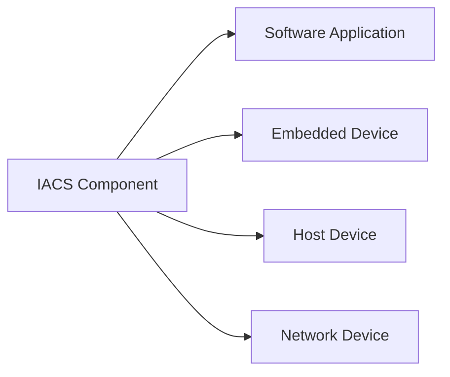
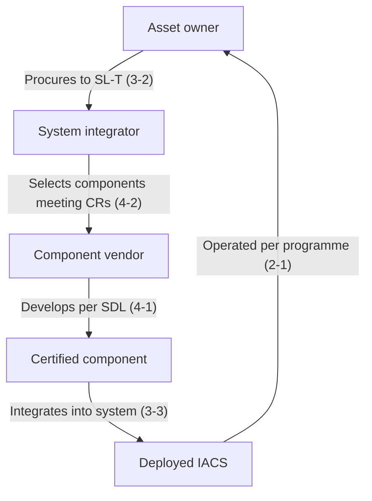

## Group 4: the component layer

Group 4 documents address the **manufacturers and developers** of IACS components — the PLCs, HMIs, network switches, safety controllers, and software applications that asset owners deploy.

Where Group 3 says "the system must authenticate users at SL 2," Group 4 says "the PLC firmware must implement an authentication API that a system integrator can use to satisfy SR 1.1 RE 1."

## IEC 62443-4-1: Secure product development lifecycle requirements

**Status:** Published (2018)

This document defines the **Secure Development Lifecycle (SDL)** that component vendors must follow. It is analogous to Microsoft's SDL or OWASP's SAMM, but tailored for industrial products with 15-year lifecycles and safety-critical deployment environments.

### The eight practices

<ResponsiveTable>

| Practice | What the vendor must do |
|---|---|
| **1. Security management** | Appoint a product security officer; define a security policy for development |
| **2. Specification of security requirements** | Derive security requirements from threat models, not just feature requests |
| **3. Secure by design** | Architecture review, attack-surface analysis, least privilege in firmware APIs |
| **4. Secure implementation** | Coding standards, static analysis, no hard-coded credentials, memory-safe practices |
| **5. Security verification & validation** | Fuzz testing, penetration testing, vulnerability scanning before release |
| **6. Management of security-related issues** | PSIRT (Product Security Incident Response Team), CVE publication, coordinated disclosure |
| **7. Security update management** | Provide patches for the product's entire supported lifecycle; define EOL policy |
| **8. Security guidelines documentation** | Ship a hardening guide with every product; document default settings, required network configuration |

</ResponsiveTable>

<HighlightBox>
  
Certification path

  
Vendors can certify their development process against IEC 62443-4-1 through accredited labs (e.g. TÜV, exida, UL). Certification is increasingly a procurement requirement from asset owners — particularly in energy, water, and nuclear sectors.

</HighlightBox>

### Practice 6: the PSIRT

A **Product Security Incident Response Team** is the vendor's equivalent of a SOC for their product line. When a researcher or customer reports a vulnerability:

1. The PSIRT triages and validates the report.
2. Develops a patch or workaround.
3. Publishes a security advisory (often coordinated with CISA ICS-CERT).
4. Provides compensating-control guidance for customers who cannot patch immediately.

<ExampleBox>
  Siemens ProductCERT, Schneider Electric PSIRT, and Rockwell Automation PSIRT are the three largest industrial PSIRTs. Each publishes monthly security advisories — sometimes dozens per month. Monitoring these advisories is a core activity of any OT security programme.
</ExampleBox>

### Practice 8: the hardening guide

Every industrial product should ship with a **hardening guide** — a document that tells the integrator:

- Which services to disable.
- Which ports to close.
- Which default passwords to change.
- Which communication protocols to restrict.
- What the minimum required network access is.

In practice, many vendors still ship products with **all services enabled and default passwords set**. 4-1 aims to change this by making the hardening guide a certification requirement.

## IEC 62443-4-2: Technical security requirements for IACS components

**Status:** Published (2019)

If 3-3 is the requirements catalogue for **systems**, 4-2 is the requirements catalogue for **individual components**. It takes the same seven FRs and maps them to component-level capabilities.

### Component types

4-2 defines four component types:

- **Software Application (SA)** — SCADA software, HMI runtime, historian application.
- **Embedded Device (ED)** — PLC, RTU, DCS controller, safety controller.
- **Host Device (HD)** — server or workstation running IACS software (Windows/Linux).
- **Network Device (ND)** — managed switch, router, firewall, wireless access point.

### Component Requirements (CRs)

4-2 defines **Component Requirements (CRs)** that mirror the SRs from 3-3 but are scoped to individual components:

<ResponsiveTable>

| 3-3 System Requirement | 4-2 Component Requirement | Component types |
|---|---|---|
| SR 1.1 (Human user IAC) | CR 1.1 | SA, ED, HD, ND |
| SR 1.2 (Software process IAC) | CR 1.2 | SA, ED |
| SR 2.1 (Authorisation enforcement) | CR 2.1 | SA, ED, HD, ND |
| SR 3.2 (Malicious code protection) | CR 3.2 | SA, HD |
| SR 3.4 (Software integrity) | CR 3.4 | SA, ED |
| SR 5.1 (Network segmentation) | CR 5.1 | ND |
| SR 7.1 (DoS protection) | CR 7.1 | ED, ND |

</ResponsiveTable>

### How 4-2 maps to SLs

Like 3-3, each CR has a base level and enhancements:

- **SL 1:** Basic authentication (username/password), audit logging.
- **SL 2:** Unique accounts, role-based access, encrypted communication.
- **SL 3:** MFA, tamper detection, signed firmware, certificate-based device identity.
- **SL 4:** Hardware-backed key storage, formal verification, continuous integrity monitoring.

<AnalogyBox>
  If 3-3 says "the house must have a lock on the front door" (system requirement), 4-2 says "the lock itself must have a 5-pin tumbler, a hardened shackle, and a pick-resistant keyway" (component requirement). The system integrator installs the lock; the lock manufacturer builds it to spec.
</AnalogyBox>

## How Group 4 connects to the rest

<HighlightBox>
  
The procurement chain

  
When you specify SL-T 3 for a zone, the integrator must select components certified to SL 3 per 4-2, developed by vendors certified per 4-1. This is how the standard enforces security through the entire supply chain.

</HighlightBox>

<KeyTakeaways>
  - 4-1 defines the Secure Development Lifecycle for component vendors — eight practices from security management to hardening guides.
  - 4-2 defines component-level security requirements (CRs) for four component types: software, embedded, host, and network.
  - CRs mirror the SRs from 3-3 but are scoped to individual components.
  - Vendor certification to 4-1 and component certification to 4-2 are increasingly required in procurement.
  - The supply chain flows: asset owner specifies SL-T → integrator selects 4-2-certified components → vendor develops per 4-1.
</KeyTakeaways>
