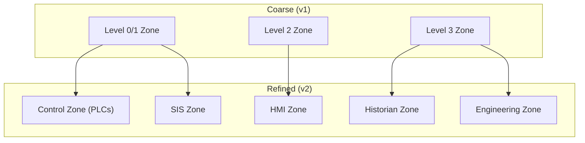

## From flat networks to structured defence

In the Foundations track you learned that flat networks are the number-one root cause behind every major ICS incident. This lesson introduces the tool IEC 62443 provides to fix that problem: the **security zone**.

<HighlightBox>
  
Definition (IEC 62443-1-1)

  
A <strong>security zone</strong> is a grouping of logical or physical assets that share common security requirements. All assets within a zone are protected to the same Security Level (SL-T).

</HighlightBox>

## Why zones, not just firewalls?

A firewall is a mechanism. A zone is a **policy decision**. You decide which assets belong together based on:

- **Function** — do they participate in the same process?
- **Risk** — do they face the same threats?
- **Trust** — do they share the same trust domain (authentication, authorisation)?
- **Criticality** — would their compromise have the same consequence?

Only after you define zones do you decide how to enforce them (firewalls, VLANs, data diodes, physical air gaps).

## Zone properties

Every zone has four defining properties:

<ResponsiveTable>

| Property | Description | Example |
|---|---|---|
| **Boundary** | The logical or physical perimeter of the zone | VLAN 10 + access control list |
| **SL-T** | The target Security Level — derived from risk assessment | SL-T 3 for the SIS zone |
| **Assets** | The devices, software, and data within the zone | PLCs, HMI, engineering workstation |
| **Conduits** | The communication paths connecting this zone to others | Modbus/TCP conduit to Level 1 zone |

</ResponsiveTable>

## Zone design principles

### 1. Minimise the attack surface

The fewer conduits a zone has, the fewer paths an attacker can exploit. Ideal: each zone has exactly one conduit to one adjacent zone. Reality: most zones have 2–4 conduits.

### 2. Group by security requirement, not by vendor

Do not create a "Siemens zone" and a "Rockwell zone." Create a "Level 1 control zone" that contains all controllers regardless of vendor, because they all face the same threats and need the same SL-T.

### 3. Isolate safety-critical assets

The SIS, burner management system, and emergency shutdown system must be in their own zone(s) with the highest SL-T. Never combine safety-critical and non-safety assets in the same zone.

<AnalogyBox>
  Zones are like hospital wards. You do not mix the neonatal ICU with the cafeteria. Each ward has its own access controls, staffing ratios, and emergency procedures — because the patients (assets) have different risk profiles.
</AnalogyBox>

### 4. Start coarse, then refine

For a first-pass risk assessment, start with broad zones aligned to Purdue levels. Then split zones where you discover assets with significantly different risk profiles.

## Common mistakes

<ExampleBox>
  <strong>Mistake 1:</strong> Putting the engineering workstation in the same zone as the HMI. The engineering workstation has PLC programming capability — a much higher privilege than the HMI's read/display function. They need different SL-Ts.  
  <strong>Mistake 2:</strong> Creating too many zones. If you have 50 zones with 200 conduits, you cannot manage them. A typical medium-sized plant should have 5–12 zones.
</ExampleBox>

## How zones feed the rest of the 3-2 process

Zones are the **unit of analysis** for everything that follows:

1. **Threat identification** — threats are assessed per zone, not per device.
2. **Risk scoring** — consequence and likelihood are scored per zone.
3. **SL-T assignment** — each zone gets its own SL-T vector.
4. **System requirements** — the SRs you implement are determined by each zone's SL-T.

<KeyTakeaways>
  - A security zone is a grouping of assets that share common security requirements.
  - Zones are policy decisions; firewalls are enforcement mechanisms.
  - Every zone has a boundary, an SL-T, a set of assets, and conduits to other zones.
  - Isolate safety-critical assets in their own zone with the highest SL-T.
  - Start with coarse zones aligned to Purdue levels, then refine based on risk.
</KeyTakeaways>
