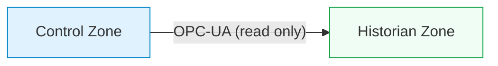

## What is a conduit?

<HighlightBox>
  
Definition (IEC 62443-1-1)

  
A <strong>conduit</strong> is a logical grouping of communication assets that protects the security of the channels it contains. A conduit connects two or more zones and controls the data flow between them.

</HighlightBox>

If zones are rooms, conduits are the doors — and each door has a lock, a direction, and a policy about what may pass through.

## Conduit properties

Every conduit must be documented with five attributes:

<ResponsiveTable>

| Attribute | Description | Example |
|---|---|---|
| **Source zone** | Where the traffic originates | Control Zone |
| **Destination zone** | Where the traffic terminates | Historian Zone |
| **Protocols** | Which protocols are permitted | OPC-UA (port 4840), ICMP echo |
| **Direction** | Unidirectional or bidirectional | Unidirectional: Control → Historian |
| **Enforcement** | The mechanism that enforces the policy | Firewall rule + data diode |

</ResponsiveTable>

## Three conduit types

### 1. Unidirectional conduit

Traffic flows in **one direction only**. The strongest conduit type.

**Use cases:**
- Historian data from Level 2 → Level 3 (process data never needs to flow back).
- Alarm data from SIS zone → monitoring zone.
- Log export from any zone → SIEM in the SOC.

**Enforcement options:**
- **Data diode** (hardware) — physically impossible to send data in the reverse direction. Vendors: Waterfall, Owl Cyber Defense, Siemens.
- **Unidirectional gateway** — software-based, cheaper, but relies on correct configuration.

<AnalogyBox>
  A data diode is a one-way valve. Water (data) flows from high pressure (OT) to low pressure (IT). No amount of pressure on the IT side can push water back through the valve.
</AnalogyBox>

### 2. Bidirectional restricted conduit

Traffic flows in **both directions**, but is strictly filtered by protocol, port, source, and destination.

**Use cases:**
- Engineering workstation ↔ PLC zone (read configs, upload programs — bidirectional but restricted to specific hosts and protocols).
- HMI ↔ PLC zone (read process values, send operator commands).

**Enforcement options:**
- **Stateful firewall** with per-rule allow list.
- **Protocol-aware firewall** (DPI for Modbus, S7comm, EtherNet/IP) that inspects at the application layer and blocks unexpected function codes.
- **Micro-segmentation** with host-based firewalls on each endpoint.

<HighlightBox>
  
Protocol-aware firewalls

  
A standard firewall sees "TCP port 502, allow." A protocol-aware firewall sees "Modbus function code 3 (read), allow; function code 5 (write coil), deny." This is the difference between letting anyone through the door and checking their ID at the door.

</HighlightBox>

### 3. Unrestricted conduit (anti-pattern)

Traffic flows freely with **no filtering**. This is not a conduit — it is a **missing boundary**.

If your zone diagram has an unrestricted conduit, it means the two connected zones are effectively one zone. Either merge them (and accept the combined risk) or add enforcement to create a proper conduit.

## Conduit design decisions

### Decision 1: Which protocols are necessary?

For each conduit, list every protocol that **must** cross the boundary. Challenge every entry:

- Does the historian really need to pull data from the PLC, or can the PLC push data through a relay?
- Does the engineering workstation need permanent access to the PLC zone, or only during scheduled maintenance windows?
- Does ICMP need to cross the boundary? (Usually no — disable ping across zone boundaries.)

### Decision 2: Which direction?

Default to **unidirectional** wherever possible. Only permit bidirectional traffic when the process function requires it.

<ResponsiveTable>

| Flow | Direction needed? | Rationale |
|---|---|---|
| Process data to historian | Unidirectional ✓ | Historian is a consumer; it never sends commands back |
| Operator commands from HMI to PLC | Bidirectional ↔ | HMI sends commands; PLC returns acknowledgements and status |
| Patch downloads from staging server | Unidirectional ↓ | Patches flow from Level 3 down; no data needs to flow up for this function |
| Remote engineering session | Bidirectional ↔ | Engineer reads config and uploads changes |
| SIEM log export | Unidirectional ↑ | Logs flow out; SIEM never sends commands to OT |

</ResponsiveTable>

### Decision 3: Time-based access?

Some conduits should only be open during specific windows:

- Engineering access to the PLC zone: **open only during scheduled maintenance**.
- Remote vendor support: **open only when a support ticket is active, closed otherwise**.
- Patch deployment: **open only during the patch window**.

<ExampleBox>
  A pharmaceutical plant implemented "conduit scheduling" — the firewall rule allowing engineering access to the PLC zone was automatically enabled at the start of each maintenance shift and disabled at the end. Outside maintenance hours, the conduit did not exist.
</ExampleBox>

## Documenting conduits in the risk register

Every conduit gets a row in the risk register with:

1. **Conduit ID** — e.g. C-01, C-02.
2. **Source zone → Destination zone**.
3. **Permitted protocols and ports**.
4. **Direction** — uni or bi.
5. **Enforcement mechanism** — firewall rule ID, data diode serial number.
6. **Owner** — who is responsible for reviewing the conduit rules.
7. **Review frequency** — quarterly is typical.

<KeyTakeaways>
  - A conduit is a controlled communication path between zones with defined protocols, direction, and enforcement.
  - Unidirectional conduits (data diodes) are the strongest type — use them wherever data only needs to flow one way.
  - Bidirectional conduits must be restricted by protocol, port, source, and destination — ideally with protocol-aware DPI.
  - Unrestricted conduits are an anti-pattern — they negate the zone boundary.
  - Time-based conduit scheduling adds an additional layer of access control.
</KeyTakeaways>
