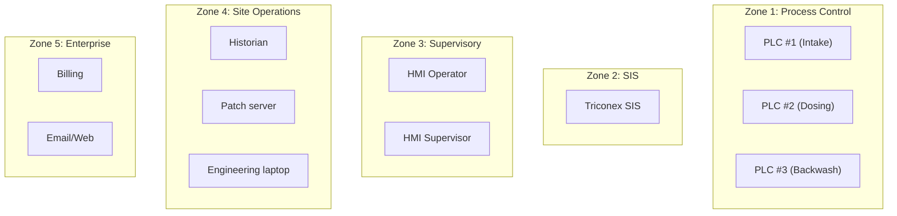

## The exercise

This lesson is a guided walkthrough of partitioning a real-world-style network into IEC 62443 security zones and conduits. By the end, you will have a complete zone & conduit diagram for a small water-treatment facility.

<HighlightBox>
  
This is the skill the rest of the course builds on

  
Every subsequent module — threat identification, risk scoring, SL-T assignment — operates on zones. If you partition incorrectly, every downstream analysis inherits the error.

</HighlightBox>

## The reference plant

A municipal water-treatment plant serving 50,000 people. It treats surface water through coagulation, sedimentation, filtration, and chlorine disinfection.

### Asset inventory

<ResponsiveTable>

| # | Device | Type | Purdue Level | Network |
|---|---|---|---|---|
| 1 | Intake pump PLC (S7-1200) | Controller | L1 | 10.10.1.0/24 |
| 2 | Chemical dosing PLC (S7-1200) | Controller | L1 | 10.10.1.0/24 |
| 3 | Filter backwash PLC (S7-1200) | Controller | L1 | 10.10.1.0/24 |
| 4 | Chlorine analyser | Sensor | L0 | via PLC I/O |
| 5 | Turbidity sensor | Sensor | L0 | via PLC I/O |
| 6 | pH sensor | Sensor | L0 | via PLC I/O |
| 7 | Intake pump VFD | Actuator | L0 | via PLC I/O |
| 8 | Chemical dosing pump | Actuator | L0 | via PLC I/O |
| 9 | WinCC HMI (operator console) | HMI | L2 | 10.10.2.0/24 |
| 10 | WinCC HMI (supervisor console) | HMI | L2 | 10.10.2.0/24 |
| 11 | AVEVA Historian | Server | L3 | 10.10.3.0/24 |
| 12 | WSUS patch server | Server | L3 | 10.10.3.0/24 |
| 13 | Engineering laptop | Workstation | L3 | 10.10.3.0/24 |
| 14 | Managed switch (L1/L2) | Network | L1/L2 | trunk |
| 15 | Managed switch (L3) | Network | L3 | trunk |
| 16 | Firewall | Network | IDMZ | 10.10.0.1 |
| 17 | Corporate router | Network | L4 | 192.168.1.0/24 |
| 18 | Billing workstation | Endpoint | L4 | 192.168.1.0/24 |
| 19 | Email/web server | Server | L4 | 192.168.1.0/24 |
| 20 | SIS controller (Triconex) | Safety | L1 | 10.10.5.0/24 |

</ResponsiveTable>

## Step 1: Identify natural zone boundaries

Look at the asset list and group by **function + security requirement**:

### Why the SIS is a separate zone

The Triconex controller manages emergency chlorine shutoff and high-level trip. Its compromise could allow a toxic release. It gets the **highest SL-T** and a dedicated conduit — never merged with the process control zone.

### Why engineering is in Zone 4, not Zone 3

The engineering laptop has PLC programming capability — the highest-privilege operation on the OT network. Placing it in Zone 3 (Supervisory) alongside the HMIs would give an attacker who compromises the HMI direct access to the engineering workstation. Keep it in the operations zone with restricted conduit access to the PLC zone.

## Step 2: Define conduits

<ResponsiveTable>

| Conduit | Source → Destination | Protocol | Direction | Enforcement |
|---|---|---|---|---|
| **C-01** | Zone 1 (Control) → Zone 3 (Supervisory) | S7comm | Bidirectional | Protocol-aware FW |
| **C-02** | Zone 2 (SIS) → Zone 3 (Supervisory) | TriStation (read-only) | Unidirectional | Data diode |
| **C-03** | Zone 3 (Supervisory) → Zone 4 (Site Ops) | OPC-UA | Bidirectional restricted | Stateful FW |
| **C-04** | Zone 4 (Site Ops) → IDMZ | Historian relay | Unidirectional | Data diode |
| **C-05** | IDMZ → Zone 5 (Enterprise) | HTTPS | Bidirectional restricted | Stateful FW |
| **C-06** | Zone 4 (Site Ops) → Zone 1 (Control) | S7comm (engineering) | Bidirectional, time-gated | Protocol-aware FW + scheduling |

</ResponsiveTable>

<ExampleBox>
  <strong>C-06</strong> is the engineering conduit. It is only active during scheduled maintenance windows. Outside those windows, the firewall rule is disabled — there is no path from the engineering laptop to the PLCs.
</ExampleBox>

## Step 3: Assign initial SL-Ts

At this stage, assign preliminary SL-Ts based on consequence severity:

<ResponsiveTable>

| Zone | Primary consequence of compromise | Initial SL-T |
|---|---|---|
| Zone 1: Process Control | Process upset, chemical misdosing | SL 2 |
| Zone 2: SIS | Loss of emergency shutdown → toxic release | SL 3 |
| Zone 3: Supervisory | Loss of operator visibility | SL 2 |
| Zone 4: Site Operations | Loss of historian, engineering access | SL 2 |
| Zone 5: Enterprise | Business disruption, data leak | SL 1 |

</ResponsiveTable>

These are **preliminary** values. The detailed risk assessment in Module 1 will refine them based on threat analysis and likelihood scoring.

## Step 4: Validate the diagram

Check your diagram against these rules:

1. **No level-skipping conduits** — does any conduit connect non-adjacent zones without passing through an intermediary?
2. **No bridge devices** — does any device have interfaces in two zones?
3. **SIS isolation** — does the SIS zone have exactly one conduit, and is it unidirectional?
4. **Engineering access** — is engineering access time-gated and protocol-filtered?
5. **Conduit count** — can you reduce the number of conduits? Fewer conduits = smaller attack surface.

<KeyTakeaways>
  - Start partitioning by grouping assets by function and security requirement, not by vendor or subnet.
  - The SIS always gets its own zone with the highest SL-T and a unidirectional conduit.
  - Engineering access should be time-gated — open only during maintenance windows.
  - Preliminary SL-Ts are based on consequence severity; detailed risk assessment refines them.
  - Validate the diagram against five rules: no level-skipping, no bridge devices, SIS isolation, engineering access control, and minimised conduit count.
</KeyTakeaways>

## Quick check

> The plant manager asks you to add a remote-access conduit so a contractor can connect to the PLCs from home. Draw the conduit on the diagram. Which zone does it terminate in? What enforcement mechanism would you require?
