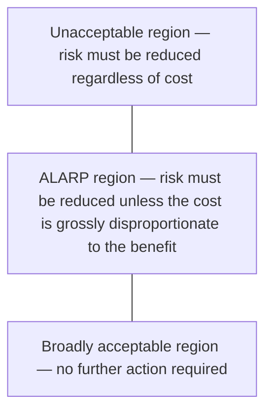

## Not all risk needs to be eliminated

Risk assessment produces a score for each zone × threat scenario. But how do you decide which risks require action and which can be accepted? The answer is **tolerable risk** — the level of risk the organisation is willing to live with.

<HighlightBox>
  
IEC 62443-3-2 §5.5

  
The asset owner must define a <strong>tolerable risk threshold</strong> for the system under consideration. Any risk above this threshold must be mitigated or formally accepted with justification.

</HighlightBox>

## The ALARP principle

**ALARP** — As Low As Reasonably Practicable — is borrowed from process-safety engineering (IEC 61508, UK Health & Safety at Work Act). It divides risk into three regions:

### The three regions

<ResponsiveTable>

| Region | Risk level | Action required |
|---|---|---|
| **Unacceptable** | Critical / High | Implement controls immediately. If controls cannot reduce risk below this threshold, the process or configuration must be changed. |
| **ALARP** | Medium | Implement controls unless the cost is grossly disproportionate to the risk reduction achieved. Document the cost-benefit analysis. |
| **Broadly acceptable** | Low | No further action required. Monitor and reassess periodically. |

</ResponsiveTable>

### "Grossly disproportionate"

This is the key phrase in ALARP. It does **not** mean "more expensive than the risk." It means the cost would be so extreme relative to the risk reduction that no reasonable person would expect it.

<ExampleBox>
  <strong>Proportionate:</strong> Deploying a $15,000 protocol-aware firewall to protect a zone with a $500,000 consequence exposure. Cost is 3% of potential loss — clearly proportionate.  
  <strong>Grossly disproportionate:</strong> Replacing all 200 PLCs at $50,000 each ($10M total) to gain encrypted communication when the same risk can be reduced to acceptable levels by network segmentation ($80,000). The $10M option is grossly disproportionate.
</ExampleBox>

## Setting the tolerable risk threshold

The threshold is set by the **asset owner's management** — not by the cybersecurity team alone. It is a business and safety decision.

### Factors to consider

1. **Regulatory requirements** — some sectors have mandated thresholds (e.g. nuclear, aviation).
2. **Safety policy** — the organisation's existing safety-risk appetite (from IEC 61511 or equivalent).
3. **Insurance requirements** — cyber-insurance policies may specify minimum security levels.
4. **Peer benchmarks** — what are similar organisations in the same sector accepting?
5. **Board risk appetite** — documented in the corporate risk-management framework.

### Typical thresholds by sector

<ResponsiveTable>

| Sector | Typical tolerable risk | Rationale |
|---|---|---|
| **Nuclear** | All risks must be in the broadly acceptable region | Zero-tolerance safety culture |
| **Oil & gas** | ALARP boundary at Medium; unacceptable at High | Major accident potential |
| **Water / wastewater** | ALARP boundary at Medium; unacceptable at Critical | Public-health consequences |
| **Manufacturing** | ALARP boundary at High; unacceptable at Critical | Primarily financial consequences |
| **Commercial building** | Broadly acceptable up to Medium | Low safety consequences |

</ResponsiveTable>

## Applying ALARP to the risk register

For each risk in the register:

1. **Compare** the risk score to the tolerable risk threshold.
2. **If above threshold:** identify controls to reduce the risk. Re-score after controls are applied.
3. **If in ALARP region:** perform a cost-benefit analysis. Document whether additional controls are proportionate.
4. **If below threshold:** accept the risk. Document the acceptance.

### Residual risk

After controls are applied, the remaining risk is **residual risk**. Residual risk must be:

- Below the tolerable risk threshold, OR
- Formally accepted by management with documented justification.

<FormulaBox title="Residual risk">
  Residual Risk = Initial Risk − Risk Reduction from Controls
</FormulaBox>

<AnalogyBox>
  ALARP is like the speed limit on a highway. Below 50 km/h is safe for everyone. Above 130 km/h is unacceptable everywhere. Between 50 and 130, the acceptable speed depends on the road conditions, the vehicle, and the driver — but you must justify your choice.
</AnalogyBox>

<KeyTakeaways>
  - The asset owner must define a tolerable risk threshold — the boundary between acceptable and unacceptable risk.
  - ALARP divides risk into three regions: unacceptable, ALARP (reduce unless grossly disproportionate), and broadly acceptable.
  - The threshold is a management decision, not a technical decision — it reflects safety policy, regulatory requirements, and business risk appetite.
  - After controls are applied, residual risk must be below the threshold or formally accepted.
  - Document everything: the threshold, the cost-benefit analysis, and any risk acceptances.
</KeyTakeaways>
