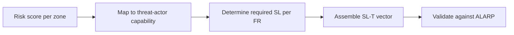

## Connecting risk scores to Security Levels

You now have:
- A **risk matrix score** (Low / Medium / High / Critical) for each zone × threat scenario.
- A **tolerable risk threshold** defined by management.
- An understanding of the **SL vector** and what each level means.

This lesson teaches the systematic process of translating risk scores into SL-T assignments.

## The derivation process

### Step 1: Map risk score to threat-actor capability

The risk score tells you which threat actors are credible for each zone. Higher risk means you must defend against more capable adversaries:

<ResponsiveTable>

| Risk score | Credible threat actors | Minimum overall SL-T |
|---|---|---|
| **Low** | Accidental, casual | SL 1 |
| **Medium** | Motivated individual, hacktivist | SL 2 |
| **High** | Sophisticated group, ransomware crew | SL 2–3 |
| **Critical** | Nation-state APT | SL 3–4 |

</ResponsiveTable>

### Step 2: Determine SL per FR

For each FR, consider which specific threats apply:

<ExampleBox>
  <strong>Zone 1 (Process Control), rated High risk:</strong> 
  <strong>FR 1 (IAC):</strong> The primary threat is unauthenticated access to PLCs. Modbus and S7comm have no native auth. Compensating control: protocol-aware firewall with per-source ACL. Required: SL 2 (unique source identification).  
  <strong>FR 5 (RDF):</strong> The primary threat is lateral movement from the supervisory zone. Required: SL 3 (protocol-aware deep-packet inspection on zone boundary).
</ExampleBox>

Some FRs may be higher or lower than the overall SL-T. This is normal — the vector allows precision.

### Step 3: Assemble the SL-T vector

Combine the per-FR values into the vector:

<ResponsiveTable>

| Zone | FR 1 | FR 2 | FR 3 | FR 4 | FR 5 | FR 6 | FR 7 | Overall |
|---|---|---|---|---|---|---|---|---|
| Zone 1 (Control) | 2 | 2 | 2 | 1 | 3 | 2 | 2 | **SL 1** |
| Zone 2 (SIS) | 3 | 3 | 3 | 2 | 3 | 3 | 3 | **SL 2** |
| Zone 3 (Supervisory) | 2 | 2 | 2 | 1 | 2 | 2 | 2 | **SL 1** |
| Zone 4 (Site Ops) | 2 | 2 | 2 | 2 | 2 | 2 | 2 | **SL 2** |
| Zone 5 (Enterprise) | 1 | 1 | 1 | 1 | 1 | 1 | 1 | **SL 1** |

</ResponsiveTable>

<HighlightBox>
  
Notice the gap

  
Zone 1 has FR 5 at SL 3 but FR 4 at SL 1. The overall zone SL is pulled down to SL 1 by the weakest element. If the asset owner wants Zone 1 at SL 2, they must raise FR 4 from SL 1 to SL 2 — which means implementing SR 4.1 (information confidentiality) at the enhanced level.

</HighlightBox>

### Step 4: Validate against ALARP

For each zone, check:

1. **Is the assigned SL-T sufficient** to reduce the risk below the tolerable threshold?
2. **Is the cost of achieving the SL-T proportionate** to the risk reduction?
3. **Are there any FRs where the SL could be lowered** without increasing risk above the threshold?

If the SL-T is insufficient, increase it. If the cost is grossly disproportionate, document the justification for accepting a lower SL.

## Worked example: SIS zone

> **Risk score:** Critical (Consequence 4 × Likelihood 3).
> **Tolerable risk:** All Critical risks must be reduced to High or lower.
> **Required SL-T:** SL 3 (minimum to defend against sophisticated groups with ICS expertise).
>
> **FR 4 (DC) challenge:** Encrypting TriStation traffic is not supported by the current Triconex firmware. Option: upgrade firmware (vendor cost: $45K, 2-day outage). Alternative: accept FR 4 at SL 2 with compensating control (dedicated VLAN, no other traffic on the segment).
>
> **Decision:** Accept FR 4 at SL 2 with compensating controls. Overall zone SL-T remains SL 2, but the compensating controls reduce the residual risk for FR 4 to within ALARP. Document the decision in the risk register.

## Common pitfalls

- **Over-assigning SL 4** — SL 4 requires hardware-backed credentials and formal verification. Very few commercial ICS products are certified to SL 4. Do not assign it unless the threat model genuinely includes a nation-state APT with unlimited resources.
- **Under-assigning FR 5** — network segmentation is the highest-leverage control. If your risk analysis shows lateral movement as a primary threat, FR 5 should be at least SL 2 in every zone.
- **Ignoring the vector** — an overall SL-T of "SL 2" without the per-FR breakdown is useless. The vector tells you exactly which controls to implement.

<KeyTakeaways>
  - Map risk scores to threat-actor capability to determine the minimum overall SL-T.
  - Determine the SL per FR based on the specific threats to each zone.
  - Assemble the full SL-T vector — the per-FR breakdown drives control selection.
  - Validate against ALARP — ensure the SL-T is proportionate to the risk and cost.
  - Document any compensating controls for FRs that cannot reach the target level.
</KeyTakeaways>
